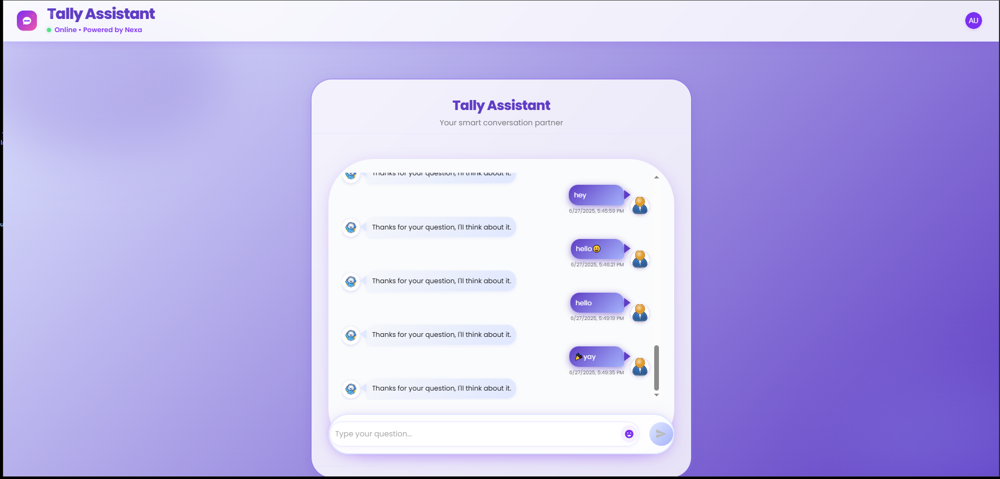
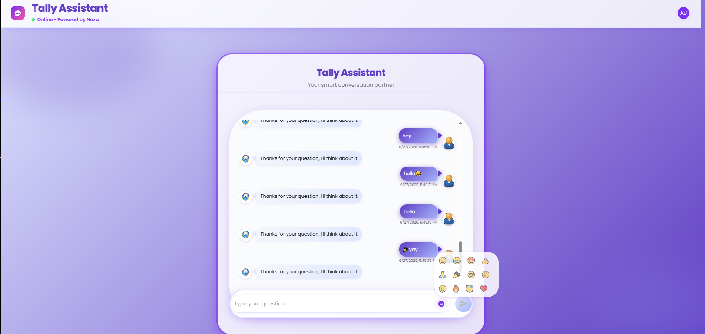

# Tally Assistant – Fullstack AI Chat App

A modern, fullstack assistant chat application built for the Nexa Consulting technical challenge. Features a beautiful React (TypeScript, MUI) frontend, FastAPI backend, and MongoDB for persistent conversation history.

---

## 🚀 Getting Started

### Prerequisites
- Node.js (v16+ recommended)
- Python 3.8+
- MongoDB (local or cloud)

### 1. Backend Setup
```bash
cd backend
python -m venv venv
source venv/bin/activate  # On Windows: venv\Scripts\activate
pip install -r requirements.txt
# Ensure MongoDB is running (default: mongodb://localhost:27017)
uvicorn main:app --reload
```

### 2. Frontend Setup
```bash
cd frontend
npm install
npm start
```

- Frontend: http://localhost:3000
- Backend API: http://localhost:8000

---

## 🛠️ Tech Stack
- **Frontend:** React, TypeScript, Material-UI (MUI)
- **Backend:** FastAPI (Python)
- **Database:** MongoDB

---

## ✨ Features
- Real-time chat UI with avatars, glassmorphism, gradients, and microinteractions
- Conversation history with timestamps and date dividers
- Typing indicator, emoji picker, error/loading states
- Responsive, mobile-friendly design
- Stores all questions and responses in MongoDB
- `/ask` endpoint for chat, `/history` for full conversation

---

## 🎥 Demo

### Screen Recording
- [Download or view demo.mp4](./demo.mp4)

### Screenshots



---

## 💡 Improvements With More Time
- Integrate a real LLM (OpenAI, Gemini, etc.) for dynamic responses
- User authentication and multi-user chat history
- Message editing, deletion, and retry on failure
- Advanced conversation context and memory
- Unit/integration tests and CI/CD pipeline

---

## 📄 Challenge Instructions
See `INSTRUCTIONS.md` for the original technical challenge brief.

---

© 2024 Tally Assistant. All rights reserved. 


